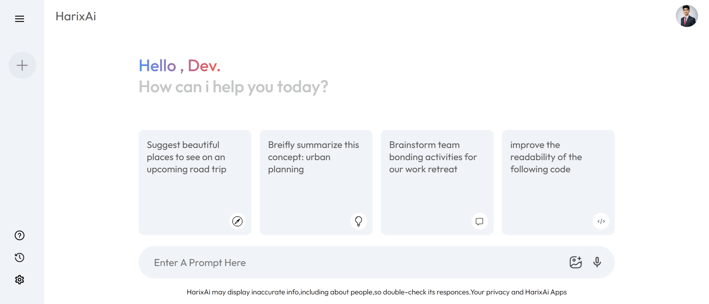

# HarixAi - Gemini Clone

A Gemini AI clone built with React and Vite, powered by Groq's LLaMA 3.3 70B model.

## 📸 Screenshot



## 🚀 Live Demo
[HarixAi Live](https://gemini-clone-app-seven.vercel.app/)

## 🛠️ Tech Stack

- React
- Vite
- Groq SDK (LLaMA 3.3 70B)
- CSS3
- React Context API

## ✨ Features

- AI-powered chat interface
- Real-time responses powered by LLaMA 3.3 70B
- Clean Gemini-inspired UI
- Prompt suggestion cards
- Chat history sidebar
- Enter key support for sending prompts
- Animated loading state

## 📦 Installation

1. Clone the repo
```bash
git clone https://github.com/HarisShahnawaz/Gemini-Clone.git
```

2. Install dependencies
```bash
npm install
```

3. Create `.env` file in root directory
```
VITE_GROQ_API_KEY=your_groq_api_key_here
```

4. Run the development server
```bash
npm run dev
```

## 🔑 Environment Variables

| Key | Description |
|-----|-------------|
| `VITE_GROQ_API_KEY` | Your Groq API key from [console.groq.com](https://console.groq.com) |

## 📁 Project Structure

```
src/
├── components/
│   ├── Main/
│   │   ├── Main.jsx
│   │   └── Main.css
│   └── Sidebar/
│       ├── Sidebar.jsx
│       └── Sidebar.css
├── context/
│   └── Context.jsx
├── assets/
└── App.jsx
```

## 🙏 Acknowledgements

- Inspired by Google Gemini
- Powered by Groq's LLaMA 3.3 70B model

## 👨‍💻 Author

**Haris Shahnawaz**
- GitHub: [@HarisShahnawaz](https://github.com/HarisShahnawaz)


## 📬 Contact
**Haris Shahnawaz** — [LinkedIn](https://www.linkedin.com/in/haris-shahnawaz-670aa8291/) | [Email](mailto:harisshahnawaz97@gmail.com)
